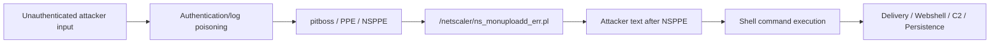

# Citrix NetScaler Zero-Day Threat Intelligence & Detection

> A practical CTI + detection-engineering repository for **CVE-2026-88771** (pre-auth command injection) and related **CVE-2026-88772** DTLS exploitation activity.

This repository is designed for four audiences:

| Audience | Start here |
|---|---|
| SOC / Monitoring | `docs/01-executive-summary.md`, `docs/06-hunting-guide.md`, `detections/` |
| Detection Engineering | `detections/yara/`, `detections/sigma/`, `detections/queries/` |
| DFIR / Incident Response | `docs/07-dfir-checklist.md`, `docs/playbooks/` |
| Threat Research | `docs/02-technical-overview.md`, `docs/03-attack-chain.md`, `docs/08-infrastructure-pivots.md` |
| CXO / Risk | `docs/01-executive-summary.md` |

## What this repo deliberately does differently

The public-facing repository separates:

1. **Exploit invariants** — stable mechanisms useful for high-fidelity detection.
2. **Campaign IOCs** — IPs, domains, URLs, hashes, paths and certificates that can rotate.
3. **Post-exploitation behaviors** — web shells, SUID changes, account creation, configuration theft, C2 and persistence.
4. **Source confidence** — observed vs. context-only vs. capability-only artifacts.

That separation is critical. `curl`, `wget`, `python`, `perl`, `tar`, `id`, `whoami`, etc. are not treated as exploit identifiers by themselves.

## Core 88771 exploit invariant



The strongest source-observed strings are variants of:

- `pitboss PPE unexpectedly died NSPPE;`
- `pitboss PPE missed too many heartbeatsNSPPE;`

with downstream processing by `ns_monuploadd_err.pl`. A three-stage chain additionally used staged Base64 in `/var/log/httpaccess-vpn.log`, extraction with `grep`/`sed`, `b64decode`, then `sh`/`php` execution.

## Repository layout

```text
.
├── README.md
├── CHANGELOG.md
├── CONTRIBUTING.md
├── NOTICE.md
├── docs/
│   ├── 01-executive-summary.md
│   ├── 02-technical-overview.md
│   ├── 03-attack-chain.md
│   ├── 04-ioc-reference.md
│   ├── 05-ttp-reference.md
│   ├── 06-hunting-guide.md
│   ├── 07-dfir-checklist.md
│   ├── 08-infrastructure-pivots.md
│   ├── 09-source-notes.md
│   └── playbooks/
├── detections/
│   ├── yara/
│   ├── sigma/
│   └── queries/
├── iocs/
│   ├── iocs.csv
│   ├── iocs.json
│   ├── stix-bundle.json
│   ├── netscaler-88771.txt
│   └── netscaler-88772.txt
├── scripts/
│   ├── validate_iocs.py
│   └── build_ioc_summary.py
└── .github/
    ├── ISSUE_TEMPLATE/
    └── workflows/
```

## Public-repo safety boundary

The source material includes credential-like values used by the observed web shells. Those values are **not placed into the primary public IOC feed**. The repository records the existence and role of those artifacts, plus non-secret fingerprints such as hashes and certificate identifiers, but does not turn the repository into a credential/payload distribution point.

The repository also avoids publishing full copy/paste exploit payloads as a default artifact. High-fidelity detection strings and behavioral logic are sufficient for defensive hunting.

## Interactive IOC explorer

`docs/index.html` provides a browser-side IOC explorer with search, CVE, type and confidence filters. The included GitHub Pages workflow publishes it from `main`.

For CTI platform ingestion, `iocs/stix-bundle.json` provides network and file-hash indicators in STIX 2.1 format; `iocs/iocs.csv` remains the canonical source for host/path artifacts.

## Quick operational use

```text
New sample / log
      |
      +--> exploit invariant match?
      |       |
      |       +--> yes --> extract network + file behavior
      |
      +--> known IOC match?
      |       |
      |       +--> yes --> pivot immediately
      |
      +--> post-exploit behavior?
              |
              +--> webshell / SUID / persistence / exfil / C2
```

## Important scope note

This repository is a source-derived CTI compilation. Vendor reports explicitly distinguish pre-disclosure exploitation, post-disclosure scanning, separate actors, and commodity tooling. Do not automatically attribute every post-disclosure probe or IOC in this repository to one actor or one campaign.

## Source set

- Tenex — *What Tenex Observed Inside Active Exploitation of NetScaler Zero-Day*
- Unit 42 — *Threat Brief: NetScaler Zero Days CVE-2026-88771 and CVE-2026-88772 Exploited in the Wild*
- LevelBlue / SpiderLabs — *Citrix NetScaler CVE-2026-88771: Observed Exploitation Artifacts and Hunt Indicators*
- CERT-EU — advisory material on active exploitation
- watchTowr — technical analysis of the 88771 exploit chain
- Mandiant / Google Threat Intelligence Group — active exploitation and post-exploitation analysis
- GreyNoise — exploitation and sensor observations
- Arctic Wolf / incident-response reporting supplied during the research process
- User-supplied Perl and Python samples

## Disclaimer

IOCs are point-in-time indicators. Treat source attribution and confidence separately from detection logic. Re-check infrastructure before blocking globally.
